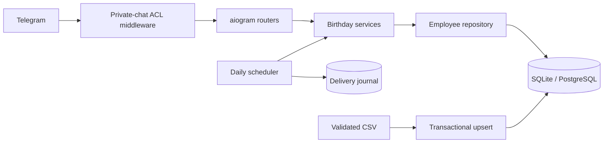

<div align="center">

# 🎂 HB Bot

**Приватный Telegram-бот, который действительно напоминает о днях рождения**

[](https://github.com/Saborrr/HB_bot/actions/workflows/ci.yml)
[](https://www.python.org/)
[](https://docs.aiogram.dev/)
[](https://www.sqlalchemy.org/)
[](LICENSE)

Дни рождения сегодня и в ближайшие дни, поиск сотрудников, календарь по месяцам, автоматические уведомления и безопасный CSV-импорт.

</div>


## Что изменилось в версии 2.0

Проект переписан из небольшого справочного скрипта в поддерживаемое приложение:

- конфигурация валидируется при запуске и больше не зависит от порядка импортов;
- единый middleware закрывает **все** сообщения и callback-кнопки;
- бот работает только в личных чатах пользователей из allowlist;
- добавлены автоматические напоминания за `7`, `1` и `0` дней;
- журнал доставок предотвращает повторную рассылку после перезапуска;
- появились `/upcoming`, `/help` и меню команд Telegram;
- поиск корректно работает с кириллицей и не воспринимает `%`/`_` как SQL-шаблоны;
- длинные ответы автоматически делятся по лимиту Telegram;
- дата рождения хранится как день, месяц и необязательный год;
- возраст вычисляется, а не хранится в устаревающем поле;
- Alembic безопасно преобразует legacy-схему;
- CSV-импорт валидируется целиком и выполняет idempotent upsert;
- добавлены Docker Compose, Ruff, pytest, dependency audit, CI и Dependabot.

## Возможности

### Команды

| Команда | Назначение |
|---|---|
| `/start` | краткая справка и кнопки месяцев |
| `/today` | дни рождения сегодня |
| `/upcoming` | ближайшие дни рождения |
| `/months` | календарь по месяцам |
| `/find Иванов` | поиск по имени или фамилии |
| `/help` | команды и политика приватности |

Команды автоматически регистрируются в меню Telegram при запуске.

### Автоматические напоминания

По умолчанию бот уведомляет:

- за 7 дней;
- за 1 день;
- в день рождения.

Горизонты, время и часовой пояс настраиваются через `.env`. Рассылка производится только в личные чаты из `NOTIFY_CHAT_IDS`, которые одновременно должны входить в `ALLOWED_USERS`.

Для 29 февраля в невисокосном году используется 28 февраля. Каждая комбинация «получатель + сотрудник + год + горизонт» записывается в журнал, поэтому обычный перезапуск не создаёт дубль.

### Приватность по умолчанию

- группы и супергруппы запрещены;
- неизвестные Telegram ID не получают данные даже через старую inline-кнопку;
- год рождения и возраст в ответах не показываются;
- SQL и персональные значения не выводятся в production-лог;
- токены, базы и `.env` исключены из Git.

Дополнительно отключите приглашение бота в группы через `@BotFather` → `/setjoingroups`.

## Архитектура



```text
src/hb_bot/
├── __main__.py          composition root и graceful shutdown
├── access.py            единый ACL middleware
├── birthdays.py         даты, возраст, 29 февраля
├── config.py            pydantic-settings
├── handlers.py          Telegram-команды
├── importer.py          CSV validation/upsert CLI
├── keyboards.py         inline-календарь
├── messages.py          разбиение длинных сообщений
├── migrations.py        отдельный CLI запуска Alembic
├── notifications.py     scheduler и дедупликация
├── presentation.py      privacy-aware форматирование
└── db/
    ├── models.py        типизированные SQLAlchemy 2 models
    ├── repository.py    запросы к справочнику
    └── session.py       async engine/session factory
```

## Требования

- Python **3.11+**;
- Telegram-бот, созданный через [`@BotFather`](https://t.me/BotFather);
- SQLite для небольшой установки или PostgreSQL для постоянной эксплуатации.

## Быстрый запуск с SQLite

```bash
git clone https://github.com/Saborrr/HB_bot.git
cd HB_bot

python -m venv .venv
source .venv/bin/activate       # Linux/macOS
# .venv\Scripts\activate        # Windows PowerShell

python -m pip install -r requirements.txt
cp .env.example .env
mkdir -p data
```

Заполните как минимум:

```dotenv
BOT_TOKEN=token-from-BotFather
DATABASE_URL=sqlite+aiosqlite:///./data/hb_bot.sqlite3
ALLOWED_USERS=123456789
NOTIFY_CHAT_IDS=123456789
TIMEZONE=Europe/Moscow
NOTIFY_TIME=09:00
REMINDER_DAYS=7,1,0
```

Затем отдельно примените миграции, импортируйте пример или свой файл и запустите:

```bash
hb-migrate
hb-import examples/employees.csv
hb-bot
```

Основные модули также можно запускать через `python -m` (миграции остаются отдельной CLI-командой):

```bash
hb-migrate
python -m hb_bot.importer examples/employees.csv
python -m hb_bot
```

`hb-bot` и `hb-import` намеренно **не запускают Alembic сами**. Это исключает гонку
между несколькими процессами. Запускайте ровно один `hb-migrate` перед обновлением
приложения; Docker Compose делает это отдельным одноразовым service `migrate`.

## Запуск через Docker Compose

```bash
cp .env.example .env
# Замените BOT_TOKEN, Telegram ID и POSTGRES_PASSWORD (URL-safe значение)

docker compose up --build -d
docker compose logs -f bot
```

PostgreSQL не публикуется наружу и хранит данные в volume `postgres-data`.

Остановка:

```bash
docker compose down
```

Команда `docker compose down -v` удаляет базу данных — не используйте `-v`, если данные нужны.

## Переменные окружения

| Переменная | Обязательность | Значение |
|---|---:|---|
| `BOT_TOKEN` | да | токен от BotFather; legacy-имя `TOKEN` тоже принимается |
| `DATABASE_URL` | да | async SQLAlchemy URL для SQLite/PostgreSQL |
| `ALLOWED_USERS` | да | положительные Telegram user ID через запятую |
| `NOTIFY_CHAT_IDS` | нет | личные chat ID получателей; должны быть в allowlist |
| `TIMEZONE` | нет | IANA timezone, по умолчанию `Europe/Moscow` |
| `NOTIFY_TIME` | нет | время рассылки `HH:MM`, по умолчанию `09:00` |
| `REMINDER_DAYS` | нет | горизонты через запятую, по умолчанию `7,1,0` |
| `UPCOMING_DAYS` | нет | период команды `/upcoming`, по умолчанию `7` |
| `LOG_LEVEL` | нет | `DEBUG`, `INFO`, `WARNING`, `ERROR` или `CRITICAL`; по умолчанию `INFO` |

Узнать собственный Telegram ID можно у специализированного ID-бота или через временный локальный вызов Telegram API. Не публикуйте ID сотрудников вместе с их датами рождения.

## CSV-импорт

Формат файла:

```csv
external_id,full_name,birth_date
employee-001,Иванов Иван Иванович,15.09.1990
employee-002,Петрова Анна Сергеевна,03.12
```

Правила:

- заголовки должны совпадать точно;
- `external_id` — стабильный уникальный идентификатор из HR-системы;
- дата: `ДД.ММ` или `ДД.ММ.ГГГГ`;
- год, если указан, должен быть от `1900` до текущего;
- строки с лишними столбцами отклоняются;
- год можно не хранить для минимизации персональных данных;
- повторный импорт того же `external_id` обновляет запись;
- дубликаты и невозможные даты блокируют весь файл до исправления;
- отсутствующие в новом CSV сотрудники автоматически не удаляются.

Команда:

```bash
hb-import path/to/employees.csv
```

Перед production-импортом сделайте резервную копию базы.

## Миграция с версии 1.x

Legacy-таблица с полями `full_name`, `birth_date` и `age` распознаётся автоматически. Миграция:

1. сохраняет существующие `id` и ФИО;
2. преобразует `ДД.ММ.ГГГГ` или `ДД.ММ`;
3. назначает прежним строкам `external_id` вида `legacy-<id>`;
4. переносит прежнее поле `age` в `legacy_age` только для сохранности данных;
   приложение его не использует и рассчитывает возраст динамически;
5. добавляет журнал уведомлений.

Если найдена повреждённая дата, миграция останавливается и сообщает только ID проблемных записей, не выводя ФИО.

**Перед обновлением обязательно создайте резервную копию.**

Миграции v2 необратимы через `alembic downgrade`: старое строковое представление
даты неоднозначно. Rollback выполняется восстановлением проверенной резервной копии.

SQLite:

```bash
cp data/hb_bot.sqlite3 data/hb_bot.sqlite3.backup
```

PostgreSQL:

```bash
pg_dump --format=custom "$DATABASE_URL_SYNC" > hb_bot.backup
```

## Разработка

```bash
python -m pip install -r requirements-dev.txt
pytest
ruff check .
ruff format --check .
pip-audit
```

Тесты покрывают конфигурацию, ACL, даты и 29 февраля, возраст, склонения, поиск кириллицы, SQL wildcard-ввод, upcoming через границу года, CSV, upsert, безопасный отказ legacy-миграции, лимит сообщений, конкурентную дедупликацию уведомлений и SQLite foreign keys.

GitHub Actions проверяет Python 3.11, 3.12 и 3.13, установленный wheel, миграции внутри Docker-образа и известные уязвимости зависимостей. Dependabot еженедельно проверяет Python-пакеты и Actions.

## Production-рекомендации

- запускайте только один экземпляр scheduler;
- не запускайте несколько `hb-migrate` параллельно;
- используйте отдельного непривилегированного пользователя или контейнер;
- храните `.env` с правами `0600`;
- регулярно пересматривайте allowlist;
- шифруйте диски и резервные копии;
- не сохраняйте тексты сообщений и ФИО в логах;
- настройте автоматическое резервное копирование и тест восстановления;
- определите владельца данных и срок хранения сведений о сотрудниках.

## Решение проблем

### Бот завершается при запуске

Проверьте обязательные переменные. Конфигурация намеренно работает fail closed: пустой или повреждённый allowlist не запускает приложение.

### Бот не отвечает пользователю

- диалог должен быть личным;
- user ID должен входить в `ALLOWED_USERS`;
- после изменения `.env` перезапустите процесс.

### Нет автоматических напоминаний

- проверьте, что `NOTIFY_CHAT_IDS` заполнен и входит в `ALLOWED_USERS`;
- пользователь должен хотя бы один раз открыть диалог с ботом и нажать Start;
- проверьте `TIMEZONE`, `NOTIFY_TIME` и `REMINDER_DAYS`;
- посмотрите логи процесса без включения SQL debug logging.

### Миграция сообщает о неправильных датах

Исправьте строки с указанными employee ID в резервной копии legacy-базы и повторите миграцию. Не удаляйте исходную базу до проверки результата.

## Безопасность

Не публикуйте токены или данные сотрудников в Issues. Инструкция по приватному сообщению об уязвимостях находится в [`SECURITY.md`](SECURITY.md).

Если Telegram-токен когда-либо попадал в Git, его нужно немедленно отозвать через `@BotFather`. Простого удаления файла недостаточно: секрет остаётся в истории и кэшах.

## Лицензия

[Apache License 2.0](LICENSE)

## Автор

[Александр Санычев](https://github.com/Saborrr)
